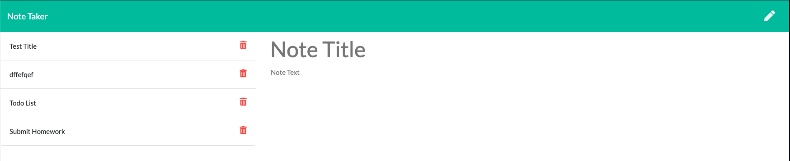
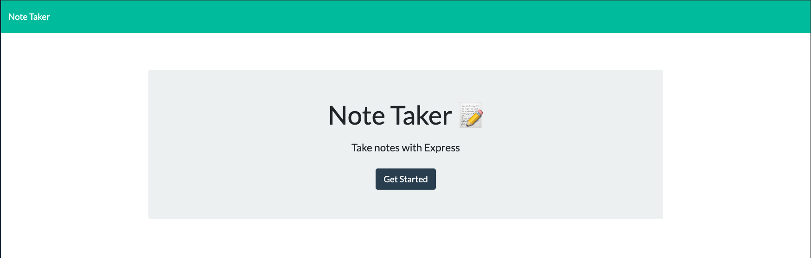

# Unit 11 Express Homework: Note Taker

 https://week11-note-taker.herokuapp.com/notes

## Description

Create an application that can be used to write, save, and delete notes. This application will uses express backend and save and retrieve note data from a JSON file.

- The application frontend was created, I built the backend and connected the two.

- The following HTML routes are used:

  - GET `/notes` returns the `notes.html` file. 

       - GET /notes returns the notes.html file.
       
       

  - GET `*` returns the `index.html` file. 

